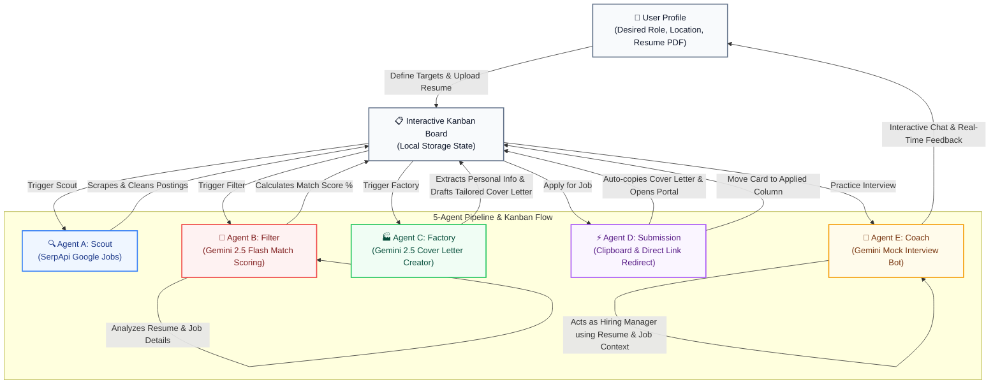

# 🚀 AI Job Search Agent Pipeline

An autonomous, end-to-end AI agent pipeline designed to automate the grueling process of finding, filtering, applying, and preparing for jobs. Built with Next.js, Tailwind CSS, Google Gemini, and SerpApi.

## ✨ Features & The 5-Agent Architecture

This application operates using five specialized AI agents that seamlessly hand off tasks to one another via an interactive Kanban Board:

1. **Agent A (Scout):** 
   - Scrapes Google Jobs in real-time via **SerpApi**.
   - Bypasses duplicates and pulls in live job postings tailored to your desired role and location.
   - Cleans and formats results natively into your "New Matches" column.

2. **Agent B (Filter):** 
   - Reads your uploaded **PDF Resume** and compares it against unscored Job Descriptions.
   - Uses **Google Gemini 2.5 Flash** to generate a highly accurate "Match Score" (%) to help you prioritize your applications.

3. **Agent C (Factory):** 
   - Dynamically writes highly compelling, professional **Cover Letters**.
   - Extracts your *actual* Name, Email, and Phone Number from your PDF resume (no `[Your Name]` placeholders).
   - Tailors the tone to be human-like, avoiding robotic AI clichés.

4. **Agent D (Submission):** 
   - Acts as a smart workflow manager. 
   - Automatically copies your tailored cover letter to your clipboard and opens the direct application portal. 
   - Falls back to a targeted Google search if the company hides their direct link.
   - Moves the job seamlessly across your Kanban board (e.g., from "New Matches" to "Applied").

5. **Agent E (Coach):** 
   - A fully interactive **Mock Interview Chatbot**.
   - Gemini adopts the persona of the Hiring Manager for the specific company you are applying to.
   - Context-aware: Asks you technical and behavioral questions based on *both* the Job Description and your Resume.
   - Evaluates your typed answers in real-time and provides feedback.

## 🔄 Agent Pipeline Workflow

The flowchart below demonstrates the autonomous execution, user data parsing, and sequential agent task handoffs that occur dynamically via the local Kanban Board:

## 🛠️ Tech Stack

* **Frontend:** Next.js (App Router), React, TypeScript, Tailwind CSS
* **Backend:** Next.js Route Handlers (Serverless APIs)
* **AI Engine:** Google Gemini (`@google/genai` SDK)
* **Web Scraping:** SerpApi (Google Jobs API)
* **State Management:** React Hooks + LocalStorage
* **File Uploads:** Local file system handling for PDF parsing

## 🚀 Getting Started

### Prerequisites
* Node.js 18+
* A [Gemini API Key](https://aistudio.google.com/)
* A [SerpApi Key](https://serpapi.com/)

### Installation

1. Clone the repository:
   \`\`\`bash
   git clone https://github.com/jagadeesvarrao-design/ai-job-search-agent.git
   cd ai-job-search-agent
   \`\`\`

2. Install dependencies:
   \`\`\`bash
   npm install
   \`\`\`

3. Set up environment variables:
   Create a \`.env.local\` file in the root directory and add your keys:
   \`\`\`env
   GEMINI_API_KEY=your_gemini_key_here
   SERP_API_KEY=your_serpapi_key_here
   \`\`\`

4. Run the development server:
   \`\`\`bash
   npm run dev
   \`\`\`

5. Open [http://localhost:3000](http://localhost:3000) in your browser.

## 💡 How to Use

1. **Setup Profile:** Navigate to the `/profile` page, enter your desired role, location, and upload your PDF resume.
2. **Scout Jobs:** Go to the `/dashboard` and click **"Run Scout Agent"**.
3. **Filter & Score:** Click **"Run Filter Agent"** to score your matches.
4. **Prepare & Apply:** Click on any job card to generate a Cover Letter, practice an Interview, or directly Apply!

## 📜 License
This project is open-source and available under the MIT License.
